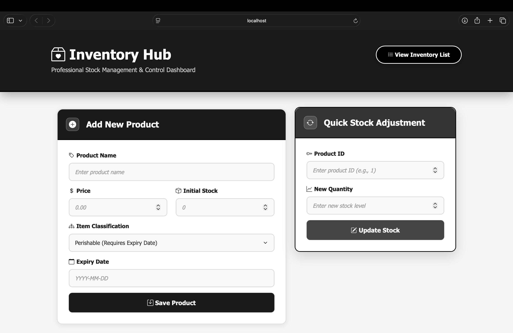
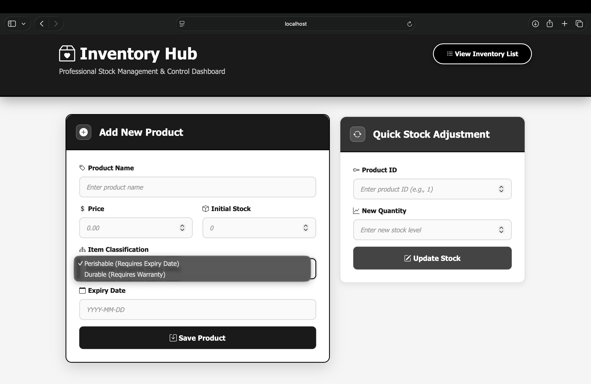
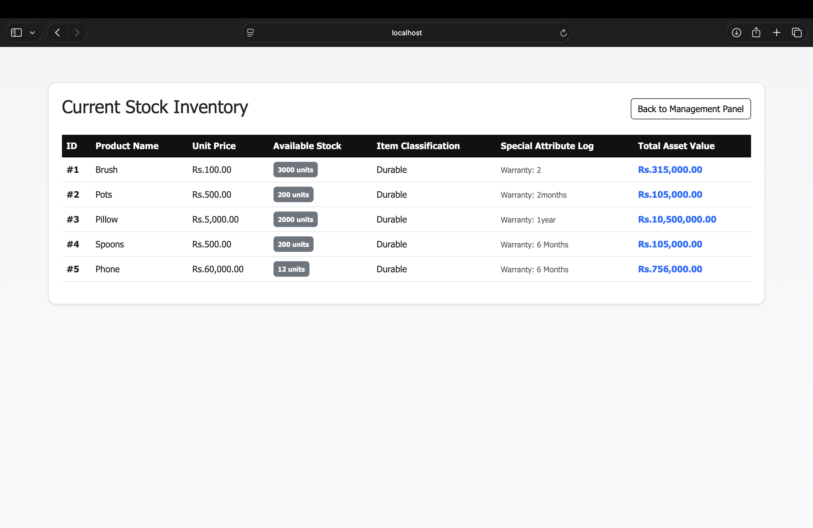
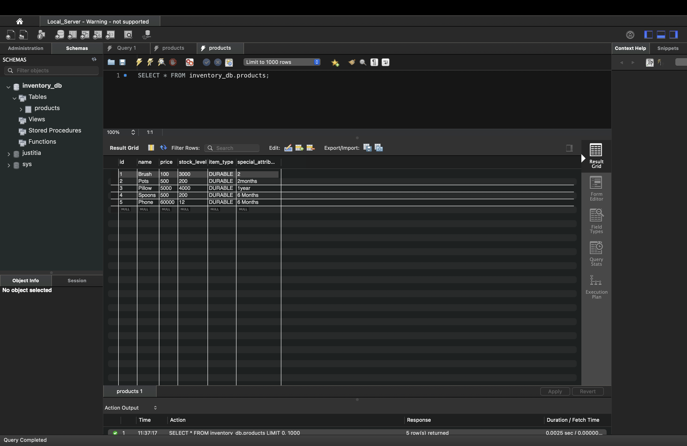

# Inventory Management System

A Java web application for recording products, updating stock quantities, and viewing the total value of current inventory. Products are represented through an object-oriented model with separate behavior for perishable and durable items.

## Application preview

### Management dashboard

Add a new product or update the stock quantity of an existing product from one dashboard.



### Product classification

Choose between a perishable product, which requires an expiry date, and a durable product, which requires a warranty period.



### Inventory list

View each product's price, available stock, classification, special attribute, and calculated total asset value.



### MySQL persistence

Product records are stored in the `products` table in the `inventory_db` MySQL database.



## Features

- Add perishable and durable products.
- Validate product names, prices, stock quantities, expiry dates, and warranty periods.
- Update stock using a product ID.
- Display current inventory and highlight low-stock products.
- Calculate stock value polymorphically for each product type.
- Persist inventory using JDBC and MySQL.
- Preserve expiry dates in the ISO `YYYY-MM-DD` format.

## Perishable item model

[`PerishableItem`](src/main/java/com/example/inventorymanagementsystem/model/PerishableItem.java) extends the abstract [`Item`](src/main/java/com/example/inventorymanagementsystem/model/Item.java) class. It adds an expiry date while inheriting the common ID, name, price, and stock fields.

The constructor passes the common values to `Item` and validates the expiry date through `setExpiryDate`. Missing dates and impossible dates such as `2026-02-30` are rejected with an `IllegalArgumentException`. Valid input is trimmed and normalized to `YYYY-MM-DD` before it is stored.

For a perishable product, total stock value is calculated as:

```text
stock value = unit price × stock level
```

Example:

```java
PerishableItem milk = new PerishableItem(
        1,
        "Milk",
        250.00,
        4,
        "2026-08-31"
);

double value = milk.calculateStockValue(); // 1000.00
```

## Technology stack

- Java 17
- Jakarta Servlet/JSP
- Maven Wrapper
- MySQL and JDBC
- JUnit 5
- Bootstrap 5 and Bootstrap Icons

## Project structure

```text
src/
├── main/
│   ├── java/com/example/inventorymanagementsystem/
│   │   ├── controller/    # Servlet request handling and validation
│   │   ├── dao/           # JDBC database operations
│   │   ├── model/         # Item, PerishableItem, and DurableItem
│   │   └── util/          # MySQL connection helper
│   └── webapp/            # JSP user interface
└── test/
    └── java/              # JUnit tests
```

## Database setup

Create the database and table in MySQL:

```sql
CREATE DATABASE inventory_db;
USE inventory_db;

CREATE TABLE products (
    id INT PRIMARY KEY AUTO_INCREMENT,
    name VARCHAR(255) NOT NULL,
    price DECIMAL(10, 2) NOT NULL,
    stock_level INT NOT NULL,
    item_type VARCHAR(20) NOT NULL,
    special_attribute VARCHAR(255)
);
```

Update the database URL, username, and password in [`DBConnection.java`](src/main/java/com/example/inventorymanagementsystem/util/DBConnection.java) to match your local MySQL configuration.

## Build and test

Requirements:

- JDK 17 or newer
- MySQL Server
- A Jakarta-compatible servlet container

On macOS or Linux:

```bash
./mvnw clean test
./mvnw package
```

On Windows:

```powershell
mvnw.cmd clean test
mvnw.cmd package
```

The packaged WAR file is created in `target/`. Deploy it to the servlet container, start MySQL, and open the deployed application URL in a browser.

## Tests

[`PerishableItemTest`](src/test/java/com/example/inventorymanagementsystem/model/PerishableItemTest.java) verifies that the model:

- Accepts and normalizes a valid expiry date.
- Rejects impossible dates.
- Rejects missing dates.
- Calculates stock value correctly.
